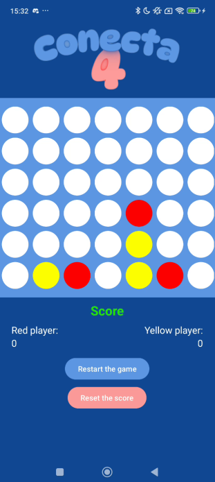

<h1> Monthly Challengy by MoureDev </h1>

## Requirements:

* A 7x6 board (7 on the "x" axis and 6 on the "y" axis).

* Red and Yellow pieces. The first game always starts with Red (the second with Yellow, the third with Red, and so on).

* There is no need to implement a feature to play against the App. It is assumed that two real players will take turns.

* When selecting a column, the piece is placed at the bottom.

* Store the number of games won by each team while the App is running.

* Two buttons: one to restart the current game and another to reset the win/loss counter.

* You can add any extra features you consider necessary.

## Information:
* You can get more information [here](https://github.com/mouredev/Monthly-App-Challenge-2022)
## View:

